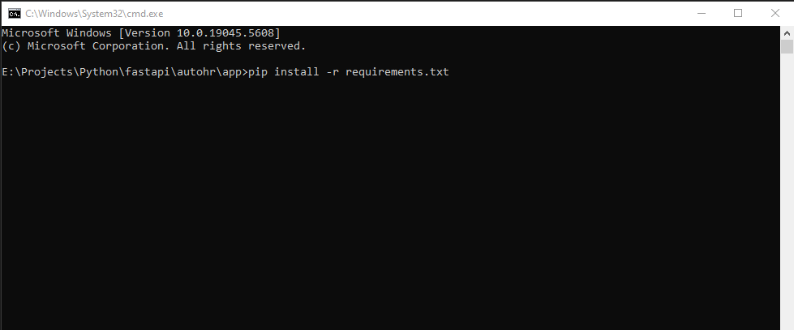
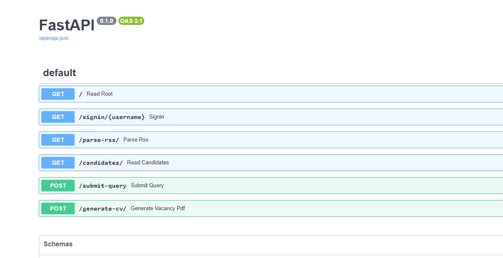
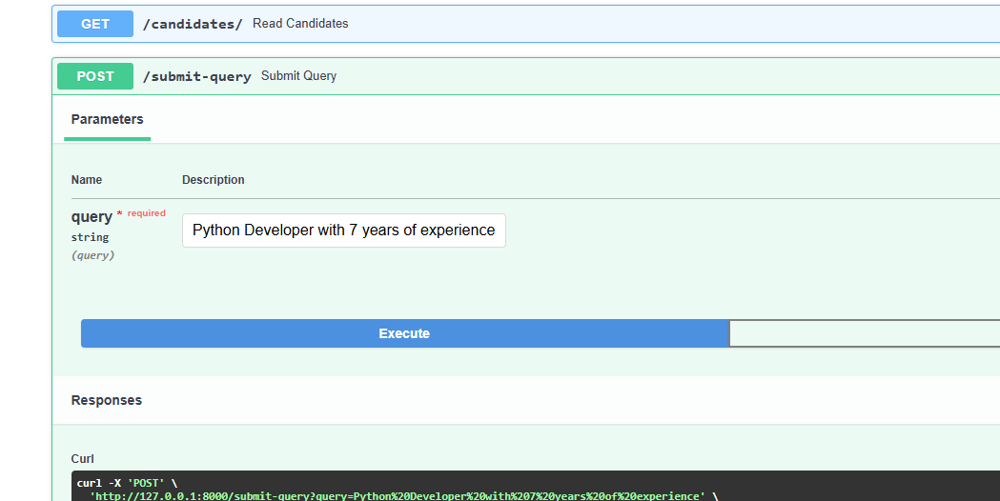
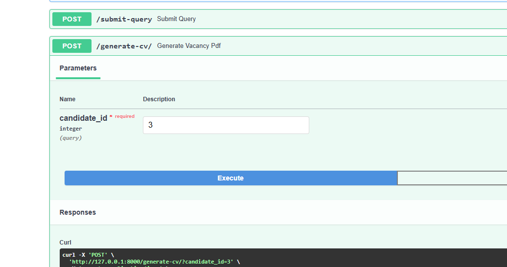

================ Getting started ================

1. Config the environment
    
    - Run the below cmd to install dependencies for python on the command prompt.
    
    `pip install -r requirements.txt`

    

    - Install the postgresql and get db url (can check in the .env.example file)
        
        `DATABASE_URL=postgres://{user}:{password}@{hostname}:{port}/{database-name}`
    
    - install database / create table

        CREATE TABLE candidates (
            id SERIAL PRIMARY KEY,
            name VARCHAR(255),
            skills VARCHAR(255),
            experience VARCHAR(255),
            source VARCHAR(255) DEFAULT 'dou.ua'
        );
        
    

2. Usage apis

    - `get: /parse-rss`

        This api parse the rss feeds from `https://jobs.dou.ua/vacancies/feeds/?category=Python`

    - `get: /candidates`

        This api will display all of the candidates from Database

    - `post: /submit-query`

        This api contains functionality to filter by query(condition)

        Example of query: 
            
            Python Developer with 7 years of experience
            Python Developer with 7+ years of experience
            ... ... ...

        

    - `post: /generate-cv`

        This api makes the PDF file with candidate's information.

        Example of query:

            Number(1, 2, 3, ... ... ...)

        